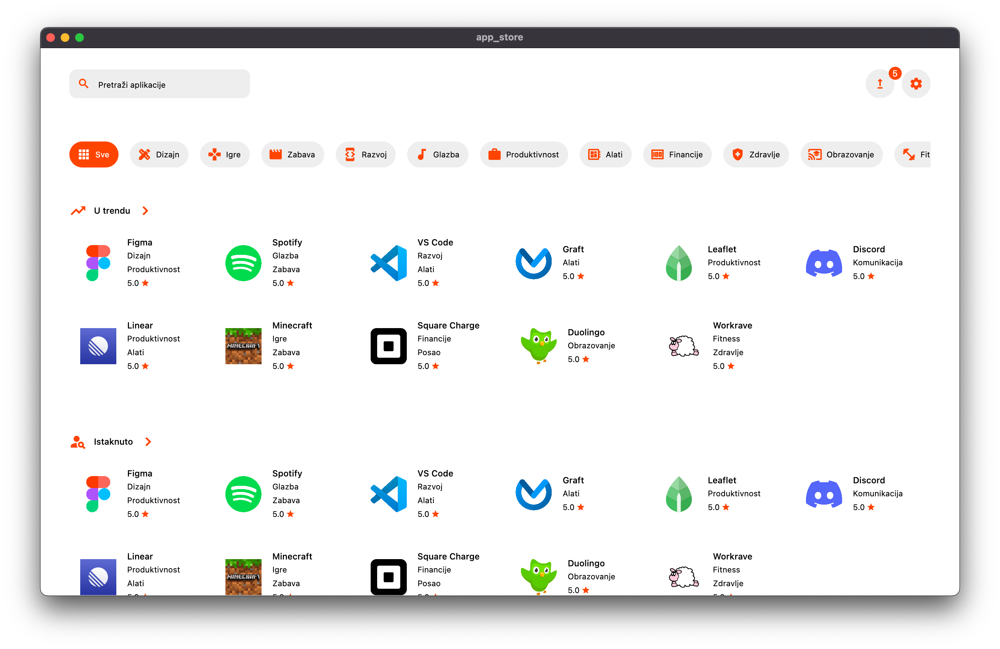

<p align="center">
  
</p>

<p align="center">
<a href="https://dahliaos.io">Website</a> •
<a href="https://dahliaos.io/discord">Discord</a> •
<a href="https://dahliaos.io/download">Releases</a> •
<a href="https://dahliaos.io/donate">Donate</a> •
<a href="https://docs.dahliaos.io">Documentation</a>

# App Store
[](https://translate.dahliaos.io/app-store)

- **Curated** marketplace for third-party applications on dahliaOS


> Landing page.

## Development

To develop and locally test the application:

### 1. Install development tools

1. Install [Flutter](https://docs.flutter.dev/get-started/install)
2. Install an IDE of your choice (we recommend [VSCode](https://code.visualstudio.com/))
    * We also recommend installing Dart and Flutter extensions if you're opting in for VSCode.
    For other IDEs, please inform yourself.

### 2. Install dependencies

Install pub dependencies required to run the application by running:

```dart
flutter pub get
```

### 3. Run the application

Run the application in an enviroment of your choice by running:

```dart
flutter run
```

Flutter has hot reloading so no need to restart the instance when it's running!

## Contribute

If you're wondering how to contribute to the project, please refer to [CONTRIBUTING.md](CONTRIBUTING.md)

## Translate

If you're interested in translating App Store, click [here](https://github.com/dahliaOS/app_store/blob/main/CONTRIBUTING.md#translations) for more information on how to do so!

## License

<p align="left">
  
  
</p>

Copyright @ 2019-2022 - The dahliaOS Authors - contact@dahliaos.io

This project is licensed under the [Apache 2.0 license](/LICENSE)
